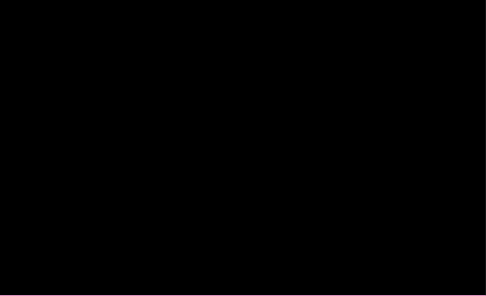
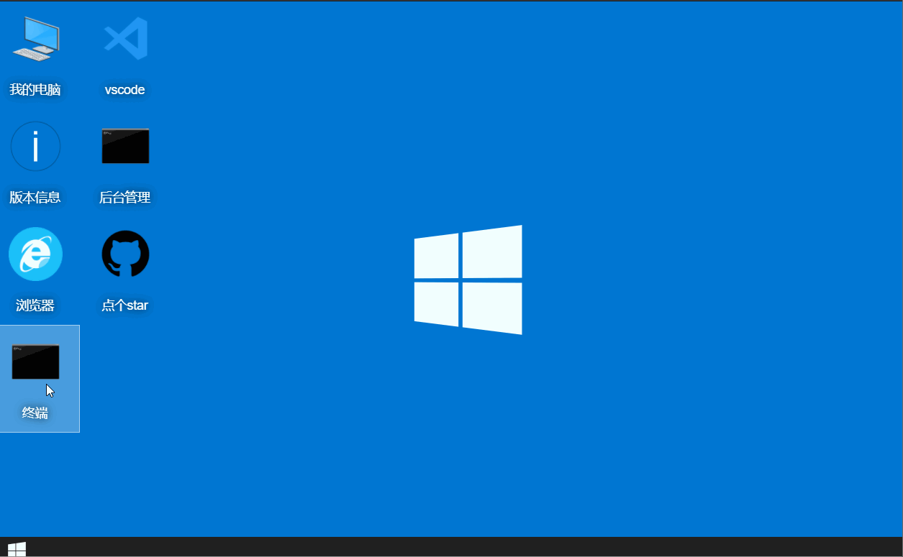

<!--
 * @Author: zhangweiyuan-Royal
 * @LastEditTime: 2021-11-18 17:11:12
 * @Description: 翻译下面的文档
-->
<h1 align="center">vue3-win10</h1>


<div align="center">

Vue3 imitation win10 UI framework
</div>

<a href="http://v3w10.myim.online" target="_blank">Document</a>|<a href="http://v3w10.myim.online" target="_blank">Official</a>|<a href="http://myim.online" target="_blank">Demo</a>

<a href="http://v3w10.myim.online" target="_blank">文档</a>|<a href="http://v3w10.myim.online" target="_blank">官网</a>|<a href="http://myim.online" target="_blank">样例</a>

<span style="color:#999;text-align:center">recommend Vue 3 + Typescript + Vite + Using `<script setup>`
</span>


This framework can turn your page into a win10 system on a web page like the win10 window system.
<!-- : [myim.online](http://myim.online) -->



# Usage

## Development steps


1. Install vue3-win10

> npm install vue3-win10

2. Use plug in in Vue

```js
import win10 from 'vue3-win10';
```
引入样式文件"vue3-win10/distlib/style.css"

```js
import "vue3-win10/distlib/style.css"
```

use

```js
import { createApp } from 'vue'
import App from './App.vue'
import win10 from 'vue3-win10';
import "vue3-win10/distlib/style.css"

createApp(App).use(win10).mount('#app')
```


3. 在页面中引入Win10租组件
 
```html
<Win10></Win10>
```

此步骤之后，run dev已经可以看到win10启动了

4. 控制屏幕🖥大小

在组件外围包裹一个outer

```html
  <div class="outer">
    <Win10></Win10>
  </div>
```
定义outer样式
  
```html
<style scoped>
.outer {
  width: 100vw;
  height: 100vh;
}
</style>
```
这样就是占据全部页面显示


4. 在apps文件夹下新建vue文件，主要在此文件夹中编写窗口内容（非必须）
